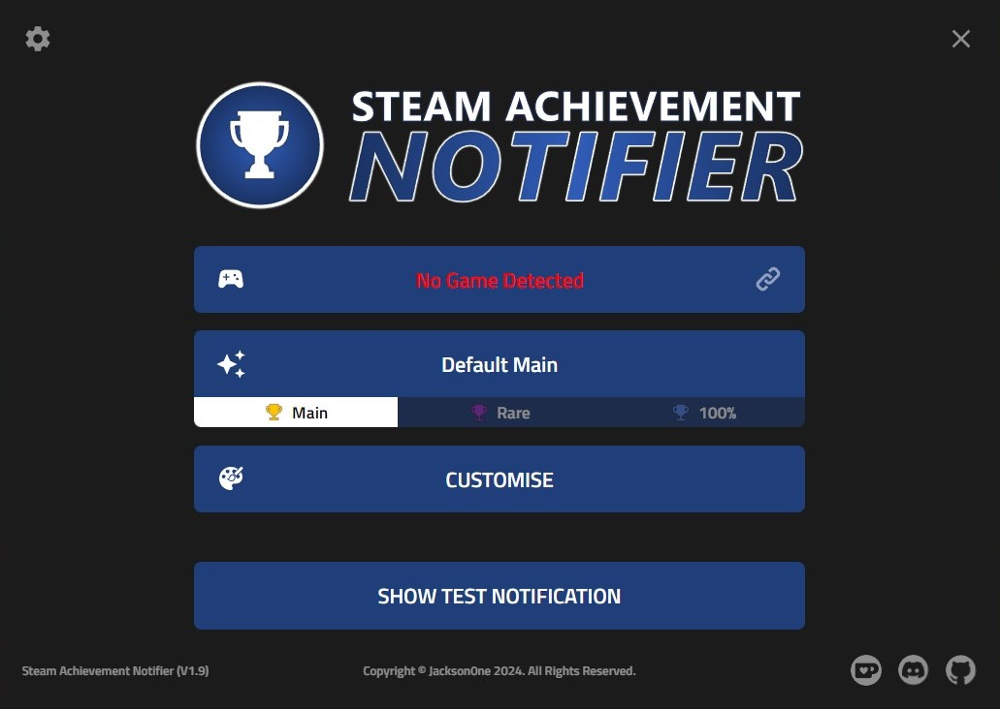

**Steam Achievement Notifier** shows fully customisable notifications when you unlock any achievement on Steam!

In the most substantial update yet, **V1.9** uses Valve's internal [Steamworks](https://partner.steamgames.com/doc/api) API to track achievement progress in realtime, displaying all the details of the achievement within the notification!

Each notification type - **Main** (*for regular achievements*), **Rare** (*for achievements with a rarity below 10%*) and **100%** (*for unlocking all achievements in any game*) - can be personalised to your liking using a wealth of customisation options available via the **Steam Achievement Customiser** menu. Just click the **Customise** button to get started!

| <a href="#features">Features</a> | <a href="#updates">Updates</a> | <a href="#installation">Installation</a> | <a href="#credits">Credits</a> |
| --- | --- | --- | --- |

<h2 align="center" id="features">Features</h2>

- 🏆 **Realtime Achievement Tracking**: By implementing Steamworks (*provided by custom fork of [steamworks.js](https://github.com/ceifa/steamworks.js/)*), **Steam Achievement Notifier** no longer requires an *API Key*/*Steam64 ID* - just run the app and start unlocking achievements, with no configuration required! This also allows greater functionality to be added in future updates, so stay tuned!

- 🖌 **Redesigned UI**: The in-app UI has undergone a complete redesign to enhance user experience, with updated elements, menus, and options for a simplified and modernised look! Once you're done customising, minimise the app window to the system tray to keep it running it in the background. In **V1.9**, the app window is also now resizable!

- 🎨 **Fully Customisable Notifications**: Each notification type provides a wealth of customisation options to truly personalise your Steam achievements! First, choose a **Notification Preset** (*each with bespoke designs and animations*). Then, start designing - change the background, shape, colours, size, display time, icons, position, font, opacity - and much more!

- 🎶 **Custom Notification Sounds**: Load custom sounds that play whenever you unlock an achievement! In the **Customiser**, choose the **Sound Mode** for each notification type: **File** (*load a single audio file*) or **Randomised** (*select a folder containing multiple audio files which are then played at random*). Adjust the in-app volume, preview the sound and then unlock achievements to hear it! (*All in-app sounds can also be muted via the new <a href="#audiosrc">**Audio Source**</a> Settings option!*)

- ✨ **Themes**: Brand new to **V1.9**, all customisations made via the **Customiser** menu can be saved as a custom **Theme**, and reloaded at any time by selecting it via the new **Theme Select** menu on the Home screen. Name your masterpiece, give it an icon (*or load your own using the **+** icon in the **Save Theme** dialog*), and switch between saved **Themes** whenever you like!

- 💯 **100% Notification Type**: The newest notification type - **100%** - will show a notification when all achievements have been unlocked in any game! Additionally, this notification type is also now fully customisable with all customisation options available for **Main** and **Rare** types (*plus more options exclusive to this type*)!

- 📷 **Additional Media Options**: Includes options to automatically take a Steam screenshot when any achievement is unlocked, as well as generating a **Screenshot with Notification Overlay** (*by selecting the dropdown option under **Settings** > **Additional Media***), which takes a screenshot of your chosen monitor, and overlays an image of the achievement notification - including all customisations! Also new to V1.9, the **Notification Image** option generates an image of the notification itself, which can then be directly shared or added as an overlay elsewhere!

> 🐧 In order to enable the **Take Steam Screenshot** option on Linux, `xdotool` must be installed on the system

> 🐧 In order to enable the **HDR Mode** option on Linux, `libxcb1`, `libxrandr2` and `libdbus-1-3` must be installed on the system

- 🎥 **Stream Notifications**: Building on the foundations of the **Duplicate Notification to Window** option available in previous versions, **Stream Notifications** creates a hidden background window that duplicates all on-screen notifications - including all customisations - which is targetable as a window source within streaming software, such as OBS/Streamlabs/Twitch Studio etc. By setting this window as your source, you can overlay all achievement notifications directly in your streams!

- 💬 **Native OS Preset**: **V1.9** adds a new **Notification Preset** type - **Native OS**\*\* shows a real OS notification containing the unlock message, achievement title and description, along with the achievement icon!

> ⚠ *Note: Some app features are not supported when this type is selected*

- 🌍 **Localisation Support**: All UI and notification elements have been translated into most Steam-supported languages - select your preferred language from the **Settings** menu!

- 📡 **Auto Updater**: Using [electron-builder's autoUpdater](https://www.electron.build/auto-update.html), users will now be notified if a new update is available - if so, downloading/installation of the new version will all be handled automatically by the app!

<h2 align="center" id="updates">Updates</h2>

<h3>UI</h3>

- **Customise Menu**: The **Customise** button is now shown more prominently on the Home screen
- **Select Theme**: Custom **User Themes** can be recalled via the new **Select Theme** menu on the Home screen
- **Collapsible Menu Sections**: All sections within both the **Settings**/**Customiser** menus are now collapsible by clicking on the section's title

<h3>System Tray Menu</h3>

- **Reset Window**: When right-clicking the system tray icon, the window size and position can be reset to default by selecting **Options** > **Reset Window**
- **Release Game**: 
- **Suspend**/**Resume**: 

<h3>Settings</h3>

- **Show Percentage**: Choose whether to show achievement percentages for **All** (*all notification types*), **Rare Only** (*only **Rare** notification types*) or **Off** (*hide for all notification types*)
- **Tracking Scale**: Increase/decrease the scale of the **Now Tracking** notification
- **Notification Shortcuts**: Set keyboard shortcuts to trigger a **Test Notification** for each notification type. Useful when testing compatibility with in-game display settings!
- **Additional Media**: Various options for generating additional media achievements are unlocked - such as **Take Steam Screenshot**, **Screenshot with Notification Overlay** and **Notification Image**
- **Audio Source**: As audio is generated from within notifications by default, a new **Settings** option has been added for **V1.9** - setting **Audio Source** to **App** will ensure that notification audio can be captured by streaming software via the app window itself (*Or, if sounds aren't your thing, mute all in-app audio by selecting the **Off** option*)
- **Screenshot Delay**: Add a delay of up to 5 seconds before taking a screenshot when using the **Screenshot with Notification Overlay** option. Useful when achievements usually unlock at inopportune times, such as during cutscene transitions!
- **Manage Linked Games**: Associate a game (via it's **AppId**) with a specific executable file on your system. **Linked Games** added via this menu will bypass <a href="#automaticprocesstracking">**automatic process tracking**</a>, so only the specified executable will be checked when the associated game's **AppID** is detected as running by Steam Achievement Notifier
- **Exclusion List**: Any AppID added to the **Exclusion List** won't be tracked for achievements while Steam Achievement Notifier is active
- **Disable App Window Animations**: For those sensitive to animations/movement (*or just if it's a preference*), you can remove all app window transition effects for all UI elements
- **Show Tooltips**: Toggle whether to show tooltip hints when hovering over UI elements
- **Poll Rate**: Increase/decrease the interval in which updates to achievement data is checked. Increasing this value may allow achievement unlock notifications to spawn faster, at the cost of slightly increased system load. Conversely, decreasing this value will reduce system load, but may cause achievement unlock notifications to spawn fractionally later
- **Check for Updates**: Check for updates to **Steam Achievement Notifier** without having to restart the application
- **App Log**: All events and errors that happen within the application from startup will now be shown in the dedicated **App Log** window
- **Use Custom App Files**: For those who love to tinker beyond what the app already provides, enable the **Use Custom App Files** option to load customisable HTML/CSS/JS files, which will then be used for notifications instead of the built-in ones! Click the **Show Custom App Files** button to open the directory where the custom files are stored, then get creative!

> *⚠ Caution is advised for casual users when editing notification files!*

<h3>Customiser</h3>

- **Custom Text**/**Use Game Title**: Set a custom unlock message for each notification of this type, or **Use Game Title** to show the game name instead
- **Custom Font**: Load a custom `.ttf`/`.otf` font file to use within the notification, instead of the default font
- **Opacity** > **Background Only**: Enable transparency only for the background of the notification, leaving all other elements at full opacity
- **Tertiary Color**: Set the color of extra elements only present in certain Notification Presets
- **Customisable Logo**/**Decoration**/**Rarity Elements**: Customise (*or completely remove*) any image element in any notification type - logos, icons, rarity indicators, XP elements etc.
- **100% Icon**: Set a custom **100% Icon** to show for all completed games
- **Save Theme**: Once your notification is looking the way that you want it, save it as a **Theme**, which can be loaded or changed from the **Theme Select** window on the Home screen
- **Hidden Icon**: Set a custom icon to indicate an achievement is a **Hidden** achievement

> ℹ *The **Hidden Icon** can be completely hidden from each notification type by unticking the **Show Hidden Icon** option. Additionally, it can be toggled in **Customiser Previews**/**Test Notifications** by clicking the / icons*

- **Use Percent**: To simulate values provided by various other achievement ecosystems, some Notification Presets will calculate an **XP**/**Score** value to display in the notification to depict the look and feel of various achievement styles as accurately as possible. If preferred, this option will display the actual achievement unlock percentage instead

<h3 id="automaticprocesstracking">Automatic Process Tracking</h3>

Due to integrating **Steamworks**, the way that games are detected as running/not running has changed in **V1.9**. This is no longer an automatic process as it was when using the **Steam Web API**. As Steamworks does not include any way to check whether a game is currently open or closed, another solution is needed.

> ℹ When initialising **Steamworks** via an application that is not the actual game - such as **Steam Achievement Notifier** - Steam will also see this external application as "**Playing**" the current game until it is also closed. This causes **Steam Achievement Notifier** to "*hold*" the current **AppID** of the game until it (or the process within it that initialised **Steamworks**) is closed - i.e. "*releasing*" the game.
>
> As **Steam Achievement Notifier** is intended to be a constantly-running background application, closing it every time a game closes is not an ideal solution.
>
> Additionally, if it does not track the current status of the game process - and the game then continues to be "held" by **Steam Achievement Notifier** - Steam will never report the game as being closed, which causes the game to remain in the "**Playing**" state in the Steam client.

To resolve this issue, **V1.9** implements **automatic process tracking** - a series of methods and fallbacks to locate the current game's executable file, and to continuously check whether this file is currently running on the user's system. Once this exectuable is no longer found to be running, it is assumed that the game has closed - **Steam Achievement Notifier** then automatically "*releases*" the game, allowing the app to start checking for new games, while also allowing Steam to reset the game's "**Playing**" state.

Additionally, there are several in-app options to control various aspects of **automatic process tracking**:

> - **Release Game**: If Steam still reports the user as "**Playing**" the game as after closing the game window, or if Steam Achievement Notifier still displays the previously closed game in the **Game Display** box/system tray menu, the game can be manually "*released*" via **System Tray** > *Right-click* > **Options** > **Release Game** option.

> - **Tracking Delay**: If Steam does not allow the game to be launched (*stating **`Game already running - <AppID>`***), try increasing the value of **Settings** > **Advanced** > **Tracking Delay**. This will increase the time between the current **AppID** being detected as running, and when **Steam Achievement Notifier** begins process/achievement tracking.
>
>   - Alternatively, increasing this value can be useful if **Steam Achievement Notifier** is detecting a **pre-game launcher** process, instead of the actual game

> - **Release Delay**: If **Steam Achievement Notifier** shows the **Now Tracking** notification for a game that has been recently closed, try increasing the value of the **Settings** > **Advanced** > **Release Delay** option to a higher value.

> - **Max Process Retries**: If the current game takes a long time to start (*and subsquently misses the initial window to locate the running exectuable - default: 10 retries at 1 retry per second*), try increasing the **Settings** > **Advanced** > **Max Process Retries** option to a higher value.

<h2 align="center" id="installation">Installation</h2>

1. Download the installer/executable from the [Releases](https://github.com/steamAchievementNotifier/SteamAchievementNotifier/releases) page (*under **Assets** at the bottom of the page*)
2. Once downloaded, run the installer/executable
3. Once the app opens, customise your notifications and start unlocking achievements!

<h3 align="center">🏆 Happy Achievement Hunting! 🏆</h3>

<h2 align="center" id="knownissues">Known Issues</h2>

- ⚠ **"Now Tracking" notification spawns repeatedly**

> ℹ When encountering this issue, try running **Steam Achievement Notifier (V1.9)** as Administrator:
> 
> - *Open the **Start Menu***
> - *Type `Steam Achievement Notifier (V1.9)`*
> - *Right-click*
> - *Select **Run as Administrator***
> 
> If running as Administrator still does not resolve the issue, try enabling **Settings** > **Alt. Process Mode**

- ⚠ **Achievement titles/descriptions are shown in English when Steam is set to use a different language**

> ℹ Try manually specifying the **Language** setting for the current game:
> 
> - *Open **Steam** > **Library***
> - *Right-click the game > Properties*
> - *On the **General** tab (selected by default), select your desired language from the **Language** dropdown menu*
> 
> This may also be caused by [adding a game to the Library while Steam's language is set to **English**](https://github.com/ceifa/steamworks.js/issues/141#issuecomment-2168689532)

<h2 align="center" id="credits">Credits</h2>

**Steam Achievement Notifier** uses (*and thanks!*) the following projects:

- A custom fork of [steamworks.js](https://github.com/ceifa/steamworks.js) by [ceifa](https://github.com/ceifa)
- A custom fork of [steamworks-rs](https://github.com/Noxime/steamworks-rs) by [Noxime](https://github.com/Noxime)
- [HackTimer](https://github.com/turuslan/HackTimer) by [turuslan](https://github.com/turuslan)
- [vdf-parser](https://github.com/rossengeorgiev/vdf-parser) by [rossengeorgiev](https://github.com/rossengeorgiev)
- [fs-extra](https://github.com/jprichardson/node-fs-extra) by [jprichardson](https://github.com/jprichardson/)
- [electron-builder/electron-updater](https://github.com/electron-userland/electron-builder)
- [Tippy.js](https://atomiks.github.io/tippyjs/)
- [jpeg-js](https://github.com/jpeg-js/jpeg-js)
- [steam-game-path](https://github.com/osztenkurden/steam-game-path) by [osztenkurden](https://github.com/osztenkurden)
- [vdf-rs](https://github.com/CosmicHorrorDev/vdf-rs) by [CosmicHorrorDev](https://github.com/CosmicHorrorDev)
- Custom forks of [screenshots (xcap)](https://github.com/nashaofu/xcap)/[display-info](https://github.com/nashaofu/display-info) by [nashaofu](https://github.com/nashaofu)
- [icojs](https://github.com/egy186/icojs) by [egy186](https://github.com/egy186)